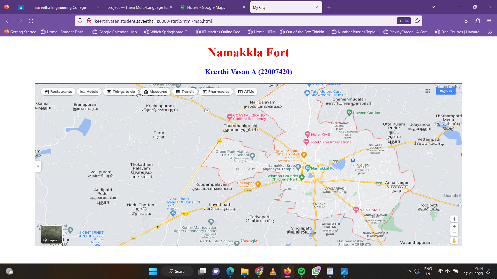
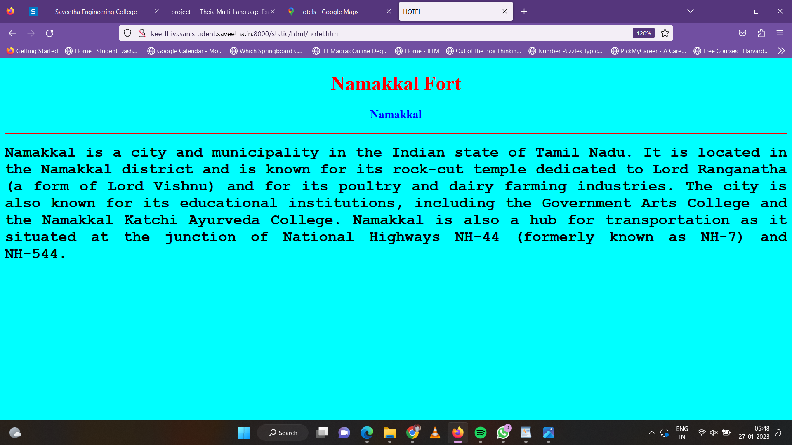
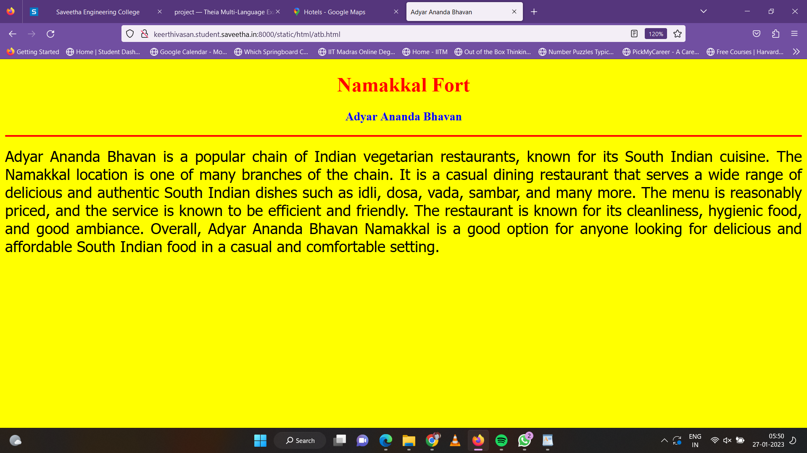
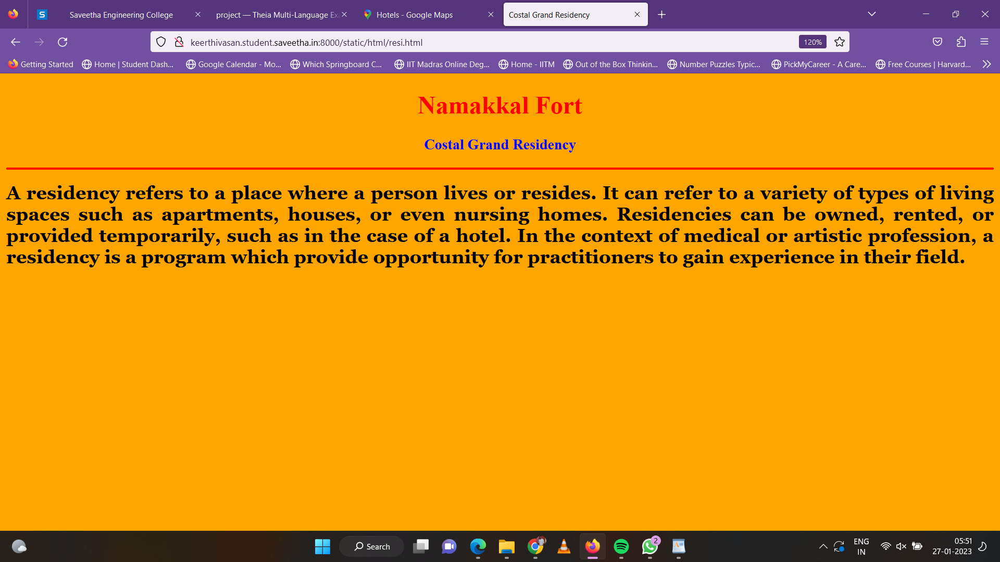
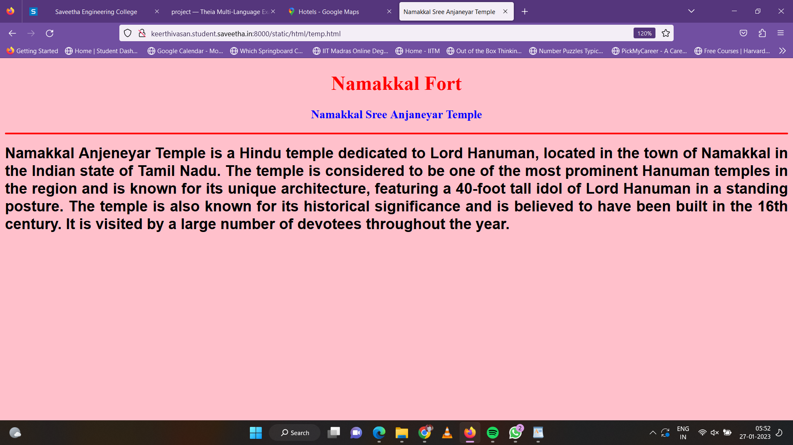
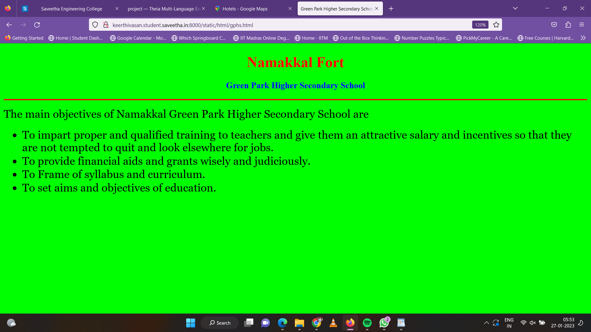
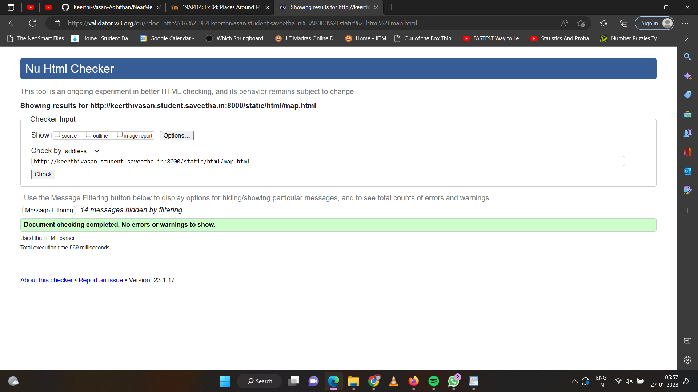

# Places Around Me
## AIM:
To develop a website to display details about the places around my house.

## Design Steps:

### Step 1:
Clone the github repository into Theia IDE.

### Step 2:
Create a new Django project.

### Step 3:
Write the needed HTML code.

### Step 4:
Run the Django server and execute the HTML files.

## Code:
```
map.html

<!DOCTYPE html>
<html lang="en">
<head>
<title>My City</title>
</head>
<body>
<h1 align="center">
<font color="red"><b>Namakkla Fort</b></font>
</h1>
<h3 align="center">
<font color="blue"><b>Keerthi Vasan A (22007420)</b></font>
</h3>
<center>

<map name="MyCity">
<area shape="circle" coords="190,50,20" href="/static/html/gphs.html" title="Green Park Higher Secondary School">
<area shape="rectangle" coords="230,30,260,60" href="/static/html/temp.html" title="Namakkal Sree Anjaneyar Temple">
<area shape="circle" coords="400,350,50" href="/static/html/resi.html" title="Costal Grand Residency">
<area shape="circle" coords="400,200,75" href="/static/html/hotel.html" title="Nala Hotel">
<area shape="rectangle" coords="490,150,870,320" href="/static/html/atb.html" title="Adyar Ananda Bhavan">
</map>
</center>
</body>
</html>


hotel.html

<!DOCTYPE html>
<html lang="en">
<head>
<title>HOTEL</title>
</head>
<body bgcolor="cyan">
<h1 align="center">
<font color="red"><b>Namakkal Fort</b></font>
</h1>
<h3 align="center">
<font color="blue"><b>Namakkal</b></font>
</h3>
<hr size="3" color="red">
<p align="justify">
<font face="Courier New" size="5">
<b>
Namakkal is a city and municipality in the Indian state of Tamil Nadu. It is located in the Namakkal district and is known for its rock-cut temple dedicated to Lord Ranganatha (a form of Lord Vishnu) and for its poultry and dairy farming industries. The city is also known for its educational institutions, including the Government Arts College and the Namakkal Katchi Ayurveda College. Namakkal is also a hub for transportation as it situated at the junction of National Highways NH-44 (formerly known as NH-7) and NH-544.
</b>
</font>
</p>
</body>
</html>


atb.html

<!DOCTYPE html>
<html lang="en">
<head>
<title>Adyar Ananda Bhavan</title>
</head>
<body bgcolor="yellow">
<h1 align="center">
<font color="red"><b>Namakkal Fort</b></font>
</h1>
<h3 align="center">
<font color="blue"><b>Adyar Ananda Bhavan</b></font>
</h3>
<hr size="3" color="red">
<p align="justify">
<font face="Tahoma" size="5">
Adyar Ananda Bhavan is a popular chain of Indian vegetarian restaurants, known for its South Indian cuisine. The Namakkal location is one of many branches of the chain. It is a casual dining restaurant that serves a wide range of delicious and authentic South Indian dishes such as idli, dosa, vada, sambar, and many more. The menu is reasonably priced, and the service is known to be efficient and friendly. The restaurant is known for its cleanliness, hygienic food, and good ambiance. Overall, Adyar Ananda Bhavan Namakkal is a good option for anyone looking for delicious and affordable South Indian food in a casual and comfortable setting.

</font>
</p>
</body>
</html>


temp.html

<!DOCTYPE html>
<html lang="en">
<head>
<title>Namakkal Sree Anjaneyar Temple</title>
</head>
<body bgcolor="pink">
<h1 align="center">
<font color="red"><b>Namakkal Fort</b></font>
</h1>
<h3 align="center">
<font color="blue"><b>Namakkal Sree Anjaneyar Temple</b></font>
</h3>
<hr size="3" color="red">
<p align="justify">
<font face="Arial" size="5">
<b>
Namakkal Anjeneyar Temple is a Hindu temple dedicated to Lord Hanuman, located in the town of Namakkal in the Indian state of Tamil Nadu. The temple is considered to be one of the most prominent Hanuman temples in the region and is known for its unique architecture, featuring a 40-foot tall idol of Lord Hanuman in a standing posture. The temple is also known for its historical significance and is believed to have been built in the 16th century. It is visited by a large number of devotees throughout the year.
</b>
</font>
</p>
</body>
</html>


gphs.html

<!DOCTYPE html>
<html lang="en">
<head>
<title>Green Park Higher Secondary School</title>
</head>
<body bgcolor="lime">
<h1 align="center">
<font color="red"><b>Namakkal Fort</b></font>
</h1>
<h3 align="center">
<font color="blue"><b>Green Park Higher Secondary School</b></font>
</h3>
<hr size="3" color="red">
<p align="justify">
<font face="Georgia" size="5">
The main objectives of Namakkal Green Park Higher Secondary School are 
<ul>
<li>To impart proper and qualified training to teachers and give them an attractive salary and incentives so that they are not tempted to quit and look elsewhere for jobs.</li>
<li>To provide financial aids and grants wisely and judiciously.</li>
<li>To Frame of syllabus and curriculum.</li>
<li>To set aims and objectives of education.</li>
</ul>
</font>
</p>
</body>
</html>

resi.html

<!DOCTYPE html>
<html lang="en">
<head>
<title>Costal Grand Residency</title>
</head>
<body bgcolor="orange">
<h1 align="center">
<font color="red"><b>Namakkal Fort</b></font>
</h1>
<h3 align="center">
<font color="blue"><b>Costal Grand Residency</b></font>
</h3>
<hr size="3" color="red">
<p align="justify">
<font face="Georgia" size="5">
<b>A residency refers to a place where a person lives or resides. It can refer to a variety of types of living spaces such as apartments, houses, or even nursing homes. Residencies can be owned, rented, or provided temporarily, such as in the case of a hotel. In the context of medical or artistic profession, a residency is a program which provide opportunity for practitioners to gain experience in their field.
</b>
</font>
</p>
</body>
</html>
```

## Output:












## HTML Validator:


## Result:
The program for implementing image map is executed successfully.